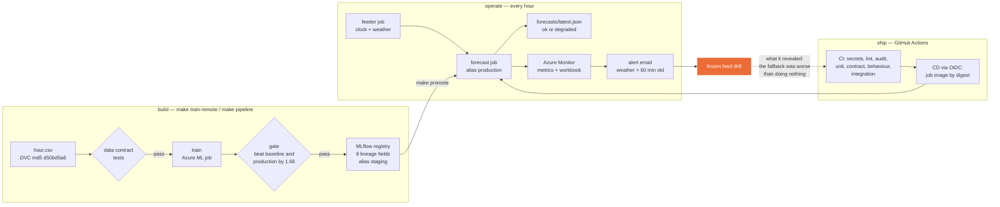

# Presentation and demo — 8 minutes + 5 of questions

The brief: *the problem in 60 seconds, the architecture, a live demo, the failure you engineered
and what it revealed, your costs, and what another week would buy. Do not spend time on model
selection.* Expect the instructor to send unexpected input during the demo.

## Architecture (one slide)

## The script

| Time | Who | What | Show |
|---|---|---|---|
| 0:00–1:00 | Siravich | The problem: dispatch plans trucks hours ahead; city-wide hourly demand for the next 24 h. Batch, because freshness is "before the hour", not milliseconds. | README top |
| 1:00–2:00 | Jirath | The architecture slide: build, ship, operate. One image per role, models by alias, everything through the adapter. | diagram above |
| 2:00–4:30 | Jirath drives | **Live:** workbook healthy → `make freeze` → two ticks later (the reading passes 60 min): output `degraded`, still the model on the last reading → alert email arrives (Siravich made the failure; Jirath reads the alert first) → `make unfreeze` → next tick `ok` | workbook, `forecasts/latest.json`, inbox |
| 4:30–6:00 | Siravich | **What it revealed:** the first design fell back to "same hour last week" — 72.1 against 54.6 for doing nothing. Changed to keep the model for 48 h, and the CI test that keeps it that way. The repeat alert would have paged ~50 times a year: now charted only. | `reports/failure-drill.md` tables, the CI test |
| 6:00–7:00 | Jirath | **Cost:** 0.015 THB a run; 38.7 THB per 1,000 forecasts at today's volume because the fixed costs dominate; 4.4 at ten areas. The Azure ML schedule we did not use: ~860 THB a month. | `reports/cost.md` |
| 7:00–8:00 | Siravich | **Another week:** per-station data; a weather forecast instead of the last reading; the model artifact in blob so the tracking server can sleep; the stale study extended past 48 h. | MODEL_CARD |

**Backup:** record the live section beforehand (with the jobs at a 5-minute tick, freeze → email
takes two ticks, ~10 minutes; for the talk, `make run-now` twice instead of waiting). If the cloud
is down, run the same sequence locally: `make simulate-freeze`.

## The clinic's three questions (Session 5) — our answers

1. **What breaks first under 10× traffic, and how would you know?** Ten times the forecasts is ten
   areas. Scoring stays milliseconds; what breaks first is **the tracking server** — one small VM
   every run loads the model from. Under load or down, every run fails; `job_success` drops and the
   failed-run alert fires, and the log line names the connection error. The fix is in the cost
   report: load the promoted model from blob storage by version.
2. **Where is your deliberate failure, and can you demonstrate it on demand?** `make freeze`, in
   the cloud or locally; detection on the first stale tick; the CI tests that hold both the
   detection and the response.
3. **What is your cost per 1,000 predictions, and where did that number come from?**
   `make cost`: Container Apps list prices × the job's size and duration, plus the fixed monthly
   costs spread over the volume; the actual from Cost Management by tag `lab=capstone` once it has
   run a week. Duration is assumed 30 s until measured on the platform.

## Unexpected input — what the system does (run locally, 2026-10-07)

`make inject TEXT='...'` (or `FILE=`) puts any text in place of the weather reading, locally or
in the cloud; the next forecast run uses it or refuses it. Nothing below crashed the job; every
refusal names its reason in `forecasts/latest.json` and in the run's JSON log line.

| Input | Status | Served | Reason the job gives |
|---|---|---|---|
| a normal reading | ok | model | — |
| text that is not JSON | degraded | baseline | weather reading is not valid JSON |
| an empty file | degraded | baseline | weather reading is not valid JSON |
| an empty document `{}` | degraded | baseline | weather reading has no values |
| a list instead of a document | degraded | baseline | weather reading has no values |
| temperature as a word | degraded | baseline | temp is not a number: 'hot' |
| °C instead of normalised (temp 25) | degraded | baseline | temp=25.0 outside [0.0, 1.0] |
| humidity −0.2 | degraded | baseline | hum=-0.2 outside [0.0, 1.0] |
| a field nobody expects | degraded | baseline | unexpected fields ['pm25'] |
| weather code 9 | degraded | baseline | weathersit=9.0 outside [1, 4] |
| a time with a timezone | degraded | baseline | weather reading has no readable time |
| a time in the future (2013) | degraded | baseline | weather reading is from the future |
| the time "yesterday" | degraded | baseline | weather reading has no readable time |
| a reading 5 hours old | degraded | model on the last reading, 300 min old | weather is 300 min old (limit 60) |
| a control file saying `banana` | — | the feed keeps running | logged as `bad_control`, read as normal (`tests/test_forecast.py`) |

An invalid reading gets the baseline, not the stale-model path, because there is no usable
weather to give the model. The 2013 row was found by this playbook: a reading from the future
passed as fresh until `src/forecast.py` refused it (`test_a_reading_from_the_future_degrades`).

If something we did not foresee does crash a run: the job exits non-zero, `job_success` 0 fires
the failed-run alert, and the last log line is `{"event": "failed", "error": "<type>: <message>"}` —
the cause in one line, inside the minute the brief asks for.
